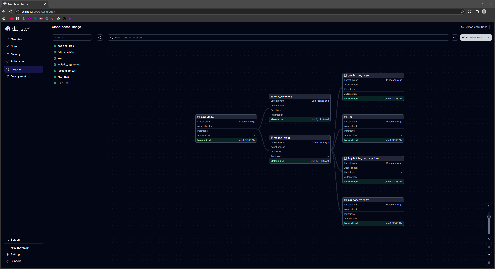
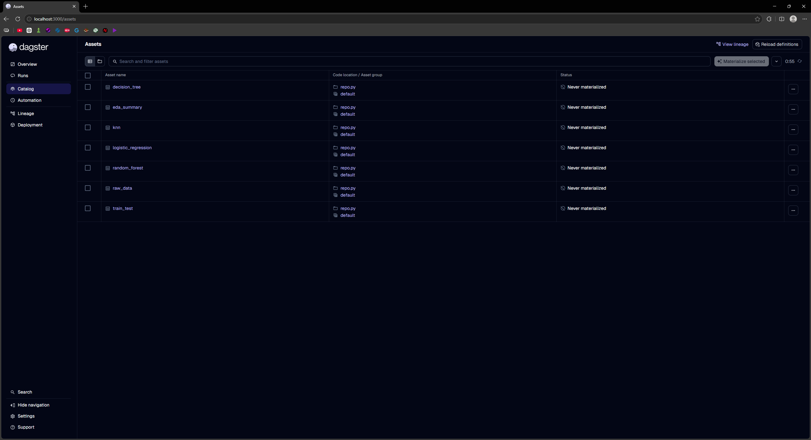
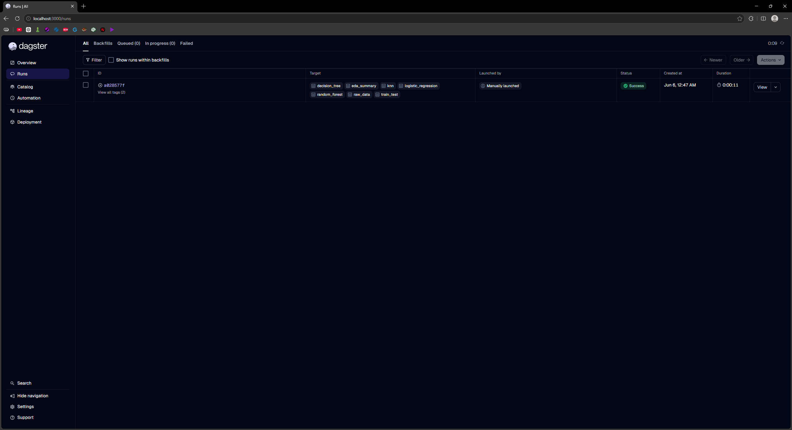

# Reproducible Machine Learning Pipeline using Dagster

## Overview

This project demonstrates how modern MLOps workflows can be built using Dagster's asset-based orchestration framework.

Traditional machine learning development often relies on monolithic Jupyter notebooks, where even minor modifications require rerunning large portions of the workflow. This project addresses that limitation by decomposing the ML workflow into reusable Dagster assets with explicit dependencies, enabling reproducibility, observability, and selective re-execution.

The pipeline performs data ingestion, exploratory data analysis (EDA), train-test splitting, model training, and evaluation while automatically tracking asset lineage and execution history.

---

## Key Features

- Asset-based machine learning workflow orchestration using Dagster
- Automated dependency tracking between pipeline stages
- Reproducible execution through asset materialization
- Selective re-execution of downstream assets when upstream data changes
- Multiple machine learning models trained within a unified workflow
- Visual asset lineage and execution monitoring through the Dagster UI
- Demonstration of core MLOps concepts including orchestration, lineage tracking, and reproducibility

---

## Pipeline Architecture

The workflow is modeled as a Directed Acyclic Graph (DAG) of Dagster assets.

```text
raw_data
├── eda_summary
└── train_test
     ├── decision_tree
     ├── random_forest
     ├── logistic_regression
     └── knn
```

### Asset Descriptions

| Asset | Purpose |
|---------|---------|
| raw_data | Loads and preprocesses the dataset |
| eda_summary | Generates descriptive statistics for exploratory analysis |
| train_test | Performs train-test splitting |
| decision_tree | Trains and evaluates a Decision Tree classifier |
| random_forest | Trains and evaluates a Random Forest classifier |
| logistic_regression | Trains and evaluates a Logistic Regression classifier |
| knn | Trains and evaluates a K-Nearest Neighbors classifier |

---

## Dataset

The project uses the Breast Cancer Wisconsin Dataset from Scikit-Learn.

### Dataset Characteristics

- 569 patient samples
- 30 numerical diagnostic features
- Binary classification problem
- Target Classes:
  - Malignant
  - Benign

The dataset is widely used for benchmarking machine learning classification workflows and pipeline orchestration systems.

---

## Model Performance

The workflow trains and evaluates multiple classification models.

| Model | Accuracy |
|---------|---------|
| Decision Tree | 94% |
| Random Forest | 97% |
| Logistic Regression | 96% |
| K-Nearest Neighbors (KNN) | 95% |

The Random Forest classifier achieved the highest predictive performance among the evaluated models.

---

# Asset Lineage

The image below illustrates dependency tracking and asset relationships managed by Dagster.



---

# Asset Catalog

Dagster automatically registers and tracks all pipeline assets through its catalog interface.



---

# Pipeline Execution

Successful materialization of all assets within the workflow.



---

## Project Structure

```text
Dagster-Reproducible-ML-Pipeline
│
├── dagster_ml
│   ├── repo.py
│   └── assets
│       └── pipeline.py
│
├── docs
│   └── screenshots
│       ├── asset_catalog.png
│       ├── asset_lineage_materialized.png
│       └── pipeline_run_success.png
│
├── dagster_ml_workflow.ipynb
├── breast_cancer_dataset.csv
├── README.md
└── requirements.txt
```

---

## Technologies Used

- Python
- Dagster
- Scikit-Learn
- Pandas
- Matplotlib
- Seaborn
- Jupyter Notebook

---

## How to Run

### Clone Repository

```bash
git clone https://github.com/MeetNotFound/Dagster-Reproducible-ML-Pipeline.git
cd Dagster-Reproducible-ML-Pipeline
```

### Install Dependencies

```bash
pip install -r requirements.txt
```

### Launch Dagster

```bash
python -m dagster dev -f dagster_ml/repo.py
```

### Open Dagster UI

```text
http://localhost:3000
```

Materialize assets through the Dagster Catalog to execute the workflow.

---

## Learning Outcomes

This project demonstrates practical understanding of:

- MLOps Fundamentals
- Workflow Orchestration
- Asset-Based Pipeline Design
- Dependency Tracking
- Reproducible Machine Learning
- Data Lineage
- Model Evaluation
- Pipeline Monitoring

---

## License

This repository is intended for educational, research, and portfolio demonstration purposes.

GitHub: https://github.com/MeetNotFound

LinkedIn: https://www.linkedin.com/in/meet-pawar
